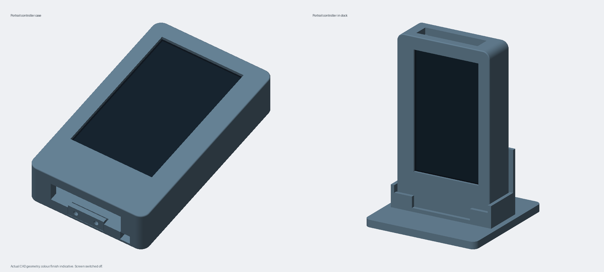
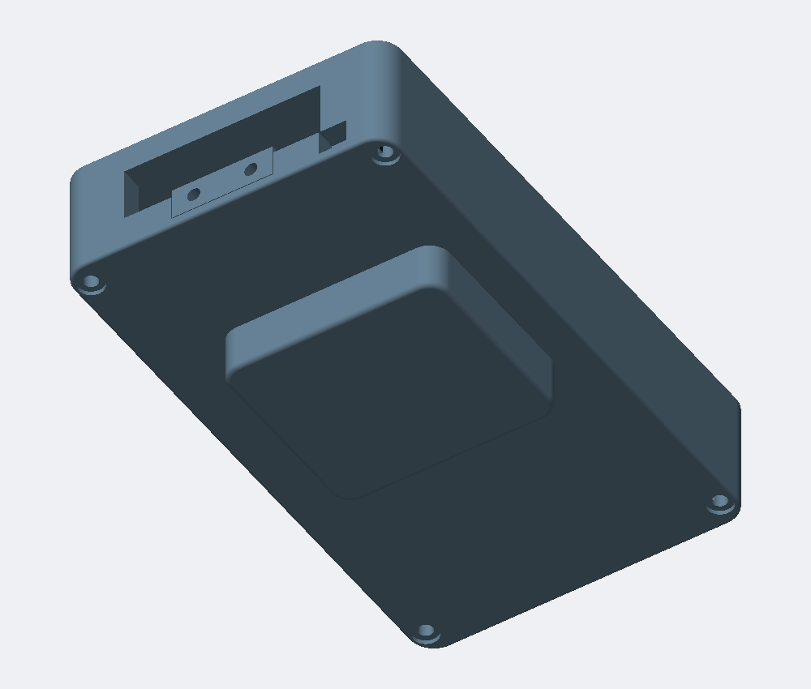

# Printable portrait controller enclosure and charging cradle

Mechanical design for the **original Waveshare ESP32-S3-Touch-LCD-4.3**, with space for a 3.7 V 1200 mAh 103440 LiPo pack. The portrait housing stands with USB sockets on its bottom short edge, matching the intended 480×800 interface. This directory is independent of `firmware/esp32/` and does not require ESP-IDF.

**Status: first-fit prototype.** Geometry is checked against the manufacturer's model, but has not been physically printed/tested. Battery size and contact hardware must be checked before ordering. This is a fully printed enclosure, not the earlier proposed wooden exterior.





## Branch scope

This hardware branch targets `main` independently of PR20 (`feature/rich-portrait-ui`). It does not contain the portrait firmware changes. The mechanical orientation supports the portrait UI; firmware rotation and touch alignment still need device acceptance.

## Source and deliverables

- `geometry.py`: editable CadQuery source for the front, rear extension, rear cover, battery tray, contact/blank inserts and keyed upright portrait dock. Dimensions are in mm. The enclosure is 80 × 138 × 28 mm, with a local battery compartment reaching 39 mm, including a lower USB pigtail/cable bay. Rear supports bear on metal mounting bosses; no separate board spacers are required.
- `build.py`: exports STL/STEP files, checks solid validity and closed meshes, checks case-to-dock clearance and optionally checks clearance against the manufacturer STEP, renders PNGs and packages files with checksums.
- `render.py`: headless software depth-buffer renderer using actual STL geometry; no GPU, desktop, Blender or display server required.
- [ASSEMBLY.md](ASSEMBLY.md): documented dimensions, print-service instructions, assembly and optional charging hardware/wiring.
- `reference/`: measured source-model dimensions and feature inspection, with attribution below. No manufacturer model is modified or vendored. The 90° placement and +10 mm board offset are described in ASSEMBLY.md.
- `previews/`: initial rendered snapshot. Fresh PNGs are generated with every hardware build; update these snapshots deliberately after design changes.

## Build locally

From the repository root, with Python 3.12:

```sh
python3 -m venv .venv-enclosure
. .venv-enclosure/bin/activate
python -m pip install -r hardware/enclosure/requirements.txt
python hardware/enclosure/test_geometry.py -v
python hardware/enclosure/build.py --output dist/enclosure --check-board
```

The optional `--check-board` downloads the official ZIP, verifies its pinned SHA-256, imports its STEP model and rejects positive collision volumes. A local verified archive can be supplied with `--board-archive /path/to/waveshare.zip`. Omit these options for an offline geometry/mesh/render build; that build does not claim board-clearance validation. The importer can take several minutes.

Outputs include seven STL print files, editable STEP files, case/docked assembly STEP, `case.png`, `docked.png`, `assembled.png`, `exploded.png`, `rear.png`, validation JSON, `SHA256SUMS`, and `print-package.zip`. Send the ZIP to a printing service, following ASSEMBLY.md's part selection. Assembly STEP is a viewing reference, not a part to print. Print at 100% in PETG.

To refresh the README preview after reviewing a build:

```sh
cp dist/enclosure/assembled.png hardware/enclosure/previews/assembled.png
```

## GitHub Actions and publishing

The **Enclosure CAD and renders** action runs for changes under this directory or its workflow, on pull requests and pushes to `main`, and can be run manually. It rebuilds the files and runs the manufacturer clearance check. Download `controller-enclosure-<commit>` (full output) or `controller-enclosure-renders-<commit>` (PNGs) from the run's Artifacts section; the summary links both. Artifacts have 30-day retention.

For durable release downloads, create a tag such as `enclosure-v0.1.0` on the reviewed commit. The action publishes a separate **Enclosure enclosure-v0.1.0** GitHub release containing the print ZIP, checksums and five PNGs. These tags do not trigger the existing firmware/prototype release workflow, whose tags begin `v`. Existing hardware releases are never overwritten. The workflow does not push generated commits or configure GitHub Pages.

## Manufacturer source

Documentation: https://docs.waveshare.com/ESP32-S3-Touch-LCD-4.3

Official archive: https://files.waveshare.com/wiki/ESP32-S3-Touch-LCD-4.3/ESP32-S3-Touch-LCD-4in3_3D_Drawing.zip

Archive SHA-256: `8721fac43de47b35771c438829a3251a4c0723227d83696b5517efe7d854de15`

Archive contains `esp32-s3-touch-lcd-4_3.stp`, dated 2023-12-13, with 693 solids. Mounting pattern 98 × 60 mm; model's total depth 16.90 mm. Measured details are in ASSEMBLY.md. The portrait enclosure is 80 × 138 × 28 mm, with a local battery compartment reaching 39 mm. The rounded 54 × 48 mm battery compartment projects 11 mm beyond the main back. Its centre is X=+4, Y=−12, towards the lower battery-header region; the dock supports the case either side of this compartment. Case corner radius is 6 mm, with 0.8 mm exposed edge rounding. The tray assumes an approximately 40 × 34 × 10 mm pack and provides a 44 × 38 × 12 mm cavity.
